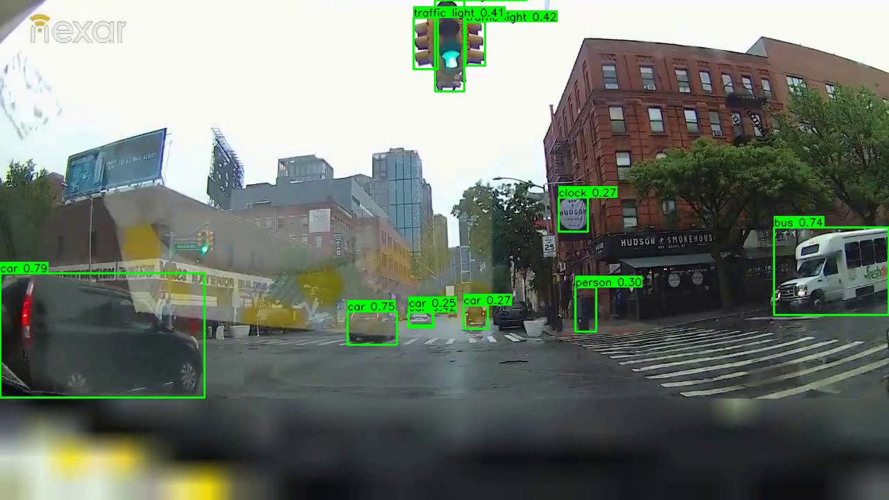
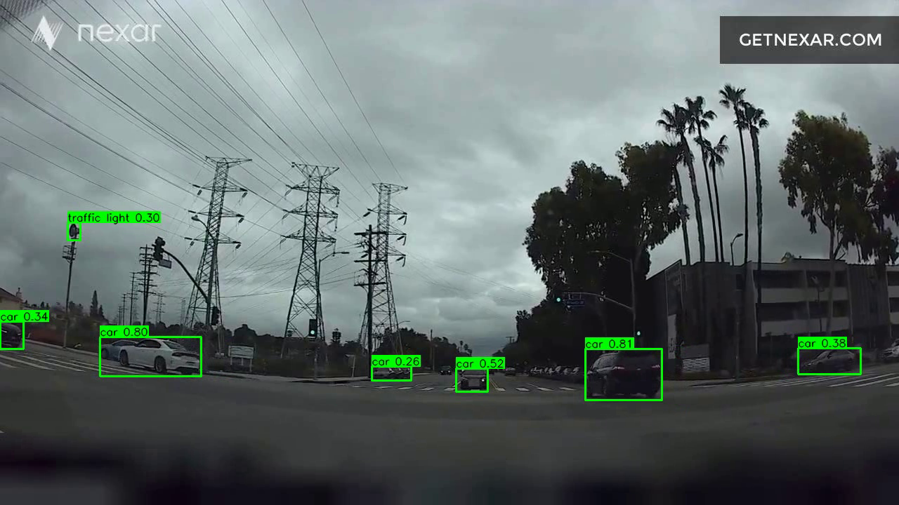
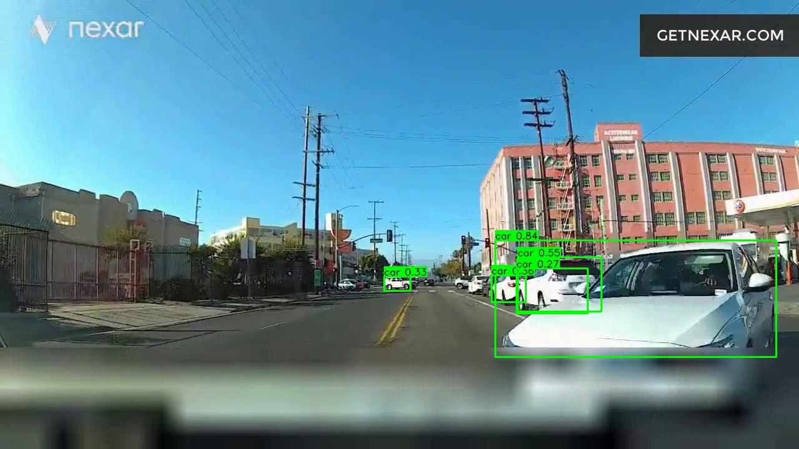

# Collision Prediction System (Nexar Dataset)

## Project Overview

## Pipeline Progress Checklist

- ✅ **EDA & Dataset Integrity**  
  _Visualize class/event distributions and event timing. Identify and handle anomalies or outliers._

- ✅ **Frame Extraction**  
  _Extract the middle 50% of frames from each video for downstream processing. Optimize for speed and memory._

- ✅ **YOLOv11 Object Detection**  
  _Run YOLOv11 on extracted frames. Save detection results and visualizations for qualitative review._

- 🟩 **SORT Tracking**  
  _Implement and integrate SORT for object tracking across frames. Extract per-object trajectories, velocities, and accelerations._

- ⬜ **Feature Construction**  
  _Build windowed feature representations using YOLO+SORT outputs. (Optional/Deferred) Experiment with CNN global features._

- ⬜ **Sequence Modeling**  
  _Train and evaluate sequence models (e.g., LSTM) for collision prediction. Experiment with window size, stride, and model variants._

- ⬜ **Evaluation & Visualization**  
  _Quantitatively evaluate model performance. Overlay predictions and tracks on video for interpretability._

- ⬜ **Documentation & Refactoring**  
  _Continually improve code modularity and clarity. Remove obsolete code and keep this roadmap updated._

---
- **Design Outcome:** Prototyped optical flow pipeline, but found it **too slow and computationally expensive** for large-scale batch processing. Decision: **abandon in favor of SORT tracking**.

### 4. SORT Tracking *(Next Step)*
- **Goal:** Track detected objects across frames to obtain temporal trajectories, velocities, and accelerations.
- **Rationale:** SORT is fast, robust, and well-suited for real-time or large-scale video analysis. It provides per-object motion statistics critical for collision prediction.
- **Status:** To be implemented (`sort_tracking.py`).

### 5. Feature Construction *(Upcoming Experiments)*
- **Goal:** Build a rich feature representation for each time window.
- **Plan:**
    - **YOLO + SORT features:** Use object detections and tracked motion statistics as the primary feature set.
    - **CNN features (optional/experimental):** Plan to experiment with adding global frame features (e.g., ResNet-18 activations) for scene context. This is deferred and not part of the current pipeline. Will compare performance:
        - YOLO + SORT features **vs.** YOLO + SORT + CNN features
- **Status:** CNN feature extraction is deferred/experimental and not currently implemented.

### 6. Sequence Modeling *(Planned)*

### 7. Evaluation & Visualization *(Planned)*
- **Goal:**
    - Quantitatively evaluate model performance.
    - Overlay predictions and object tracks on video for interpretability.
- **Plan:** Update visualization scripts to show SORT trajectories and model predictions.

### 8. Documentation & Refactoring *(Ongoing)*
- **Goal:**
    - Keep the codebase modular and maintainable.
    - Remove obsolete scripts/data (especially optical flow), document all design decisions, and ensure all scripts use progress bars (tqdm).

---

## Example Outputs

Below are sample visualizations from the YOLO object detection pipeline, produced by running `scripts/yolo_detect.py --visualize` on extracted frames. Bounding boxes and class labels are overlaid on each frame, and the results are compiled into .mp4 videos for qualitative review.

**Sample Detection Images:**

<p align="center">
  
  
  
</p>

**Example Full Detection Videos:**

- [YOLO Detection Visualization 1](examples/00005/detections.mp4)
- [YOLO Detection Visualization 2](examples/00014/detections.mp4)
- [YOLO Detection Visualization 3](examples/00036/detections.mp4)

> _Note: GitHub does not support inline playback of .mp4 files. Click the links above to download and view the videos locally._

- **Goal:** Predict collisions from sequences of feature vectors.
- **Model:** LSTM baseline (with potential to try transformers/TCN in future).
- **Plan:** Train on windowed feature sequences; evaluate using standard metrics.

## Summary Table: Progress & Next Steps

| Step                          | Status      | Key Decisions/Notes                                             |
|-------------------------------|-------------|----------------------------------------------------------------|
| Frame Extraction              | Done        | Middle 50% only; resized to 224×224                            |
| YOLO Object Detection         | Done        | YOLOv11 on all extracted frames                                |
| Optical Flow                  | Ablated     | Too slow; replaced by SORT                                     |
| SORT Tracking                 | Next        | Fast, robust; to be implemented                                |
| Feature Construction          | Upcoming    | Compare YOLO+SORT vs. YOLO+SORT+CNN features                   |
| Sequence Modeling (LSTM)      | Planned     | Baseline; may try transformers/TCN later                       |
| Evaluation & Visualization    | Planned     | Overlay tracks/predictions; quantitative metrics                |
| Documentation & Refactoring   | Ongoing     | Remove obsolete code/data; document design process              |

## Repository Structure
```
CrashDetection/
├── src/                # Core modules (feature extraction, dataset, models)
├── scripts/            # Pipeline & utility scripts
├── data/               # Processed data (frames, detections, features)
├── models/             # Model checkpoints
├── original_data/      # Raw MP4 videos (not in git)
├── notebooks/          # EDA, visualization (empty for now)
├── requirements.txt    # Python dependencies
└── README.md           # Project overview and plan
```

> **Note:** Most processed data in `data/` (frames, detections, features), all raw videos in `original_data/`, and large model checkpoints are **excluded from GitHub** due to size. Only code, scripts, and lightweight configs are versioned in git. You must generate or obtain the data separately to run the pipeline.

---

## Design Principles
- **Efficiency:** Only process the most informative frames; avoid expensive computations unless justified by results.
- **Modularity:** Each step is a separate, testable module/script.
- **Transparency:** All design choices and ablations are documented for reproducibility and discussion.
- **Experimentation:** Plan to compare feature sets and models to find the best approach.

